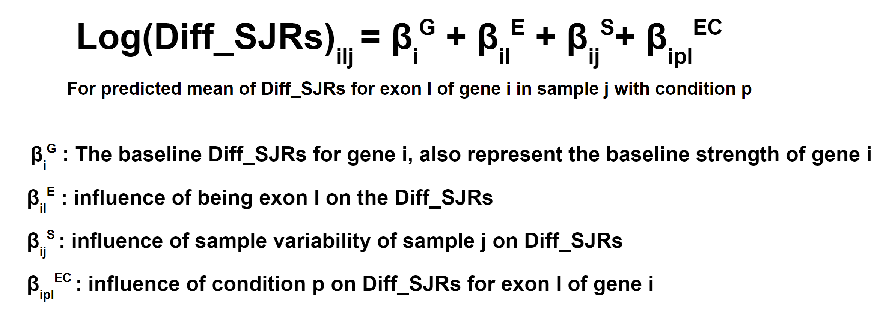
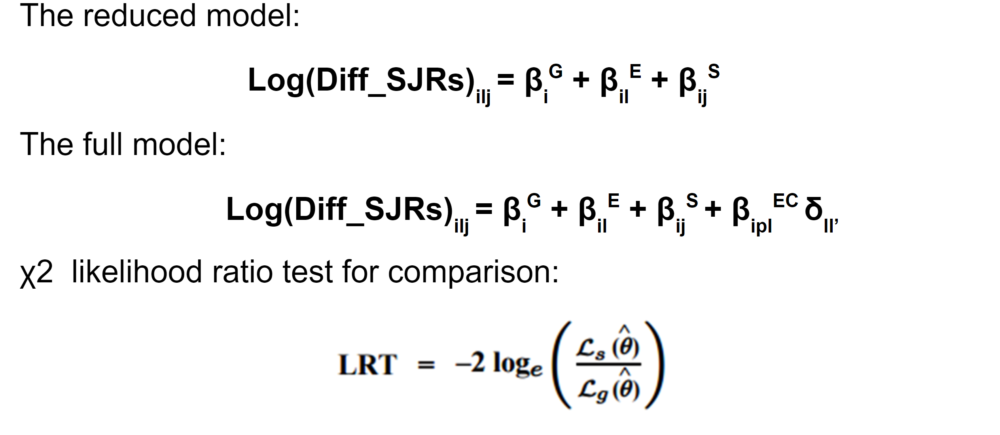

# SpliceImpactR

<p align="right">

</p>


by Zachary Wakefield


SpliceImpactR is an R package designed for studying the impact of alternative splicing on protein structure and function. It provides tools for analyzing RNA-seq data to identify splicing events and predict their consequences on the resulting protein products. 

The suite of funcitons is designed to anaylyze the consequences of AFE, ALE, SE, MXE, A5SS, and A3SS, along with hybrid exons (HFE, HLE). SpliceImpactR is built to take output from the [HIT Index](https://github.com/thepailab/HITindex) and [rMATS](https://github.com/Xinglab/rmats-turbo). 

SpliceImpactR first identifies differentially included exons across the input phenotypes. This is performed differently for HIT Index output (AFE/ALE/HFE/HLE) and rMATS output (SE/MXE/A5SS/A3SS).

## HIT Index Statistical Method
This model is an R implementation of this HIT Index [statistical model](https://github.com/fiszbein-lab/HIT_Index_Stat_Analysis-/tree/main), written by Xingpei Zhang and Zachary Wakefield. The linear regression model for differetnial exon usage is adepted from [Anders et al.](https://www.ncbi.nlm.nih.gov/pmc/articles/PMC3460195/) (2012). It assumes that the average between upstream and downstream spliced junction reads for an exon can be regressed by a log-linear model. The statistical model uses χ2 likelihood ratio test to compare a reduce model with a full model and test on whether phenotype has an influence on difference between spliced junction reads which is a direct estimator for PSI values according to [Fiszbein et al.](https://pubmed.ncbi.nlm.nih.gov/35044812/) (2022).

<p align="center">

</p>

<p align="center">

</p>
## rMATS Statistical Method

Further, SpliceImpactR uses a linear model and a generalized linear model to identify differentially included AFE/ALE and SE, respectively. These results are then matched up to annotations using jaccard index matching and associated with a specific transcript. Analyses are performed both on a paired and a global level -- paired analysis involves idenfitied "exon swaps": where each phenotype shows a significant usage of different exons from the same gene. Global analysis looks at overall changes across phenotypes, such as domain enrichment in significantly differentially included exons. The matched transcripts are analyzed on various different levels:
1. Primary Sequence
2. Domain Content
3. Transcript-Transcript Interactions

   

## Features
Identification of alternative splicing events from RNA-seq data.
Analysis of the potential impact of splicing events on protein structure.
Functional annotation of spliced isoforms to predict their biological impact.
Integration with existing bioinformatics tools and databases for comprehensive analysis.

## Installation
You can install SpliceImpactR directly from GitHub using the devtools package. If you do not have devtools installed, you can install it first with:

```r
install.packages("devtools")
```
Then, to install the package:
```r
devtools::install("zachpwakefield/SpliceImpactR")
```

## Usage
```r
library(SpliceImpactR)
```

Make an output directory for the pipeline along with identifying the package directory
```r
output_location <- ## Directory for output
system(paste0("mkdir ",  output_location))
pdir <- system.file(package="domainEnrichment")
```

SpliceImpactR requires files organized in a particular way:
```
sample_name/
  sample_name.AFEPSI
  sample_name.ALEPSI
  sample_name.exon
  sample_name.SEPSI
  ...
```
In order to accomplish this, there is the function organizeSamples(). This works if your files are currently organized as such:
```
sample_name/
  rmats/
    sample_name.AFEPSI
    sample_name.ALEPSI
    sample_name.exon
  hit/
    SE.MATS.JC.txt
    ...
```

```
test <- ## Test sample names
control <- ## Control sample names

organizeSamples(paste0('/projectnb2/evolution/zwakefield/tcga/runs/', c(test, control), '/'), cores = 2)
```

Load paths for your test and control groups
eg: output_location/sample_name/sample_name
```
test_group <- paste0(output_location, 'data/', tumor, '/', tumor)
control_group <- paste0(output_location, 'data/', control, '/', control)
```
Identify the differentially included exons through differential_inclusion_rMATS or differential_inclusion_HITindex:
```
diSE <- domainEnrichment::differential_inclusion_rMATS(test_names = test_group, control_names = control_group, et = "SE", cores = 8, outlier_threshold = "4/n", min_proportion_samples_per_phenotype = .333)
diHIT <- domainEnrichment::differential_inclusion(test_names = test_group, control_names = control_group, cores = 16, outlier_threshold = "4/n")

c_trans <- domainEnrichment::get_c_trans(pdir)
gtf <- domainEnrichment::get_gtf(pdir)

bg_input <- gsub("[^/]*$", "", c(control_group, test_group))
bg <- getBackground(input=bg_input,
                    mOverlap = .2,
                    cores = 30,
                    nC = length(control_group),
                    nE = length(test_group),
                    exon_type = "SE", 
                    pdir = pdir,
                    output_location = output_location)

fg <- getForeground(input=diSE,
                    test_names = test_group, 
                    control_names = control_group,
                    thresh = .2,
                    fdr=.05,
                    mOverlap=.2,
                    cores=4,
                    nC=length(control_group),
                    nE=length(test_group),
                    exon_type="SE",
                    pdir=pdir,
                    output_location=output_location)

#####
## Extract pairs with +/-

pfg <- getPaired(foreground = fg$proBed)

#####
pfam <- domainEnrichment::getPfam(foreground = fg, background = bg, pdir = pdir, cores = 4, output_location = output_location)


gD <- getData(output_location = output_location, fdr_use = .05, min_sample_success = 3, engine = "Pfam")

iDDI <- domainEnrichment::init_ddi(pdir = pdir, output_location = output_location, ppidm_class = "Gold", removeDups = T)

# ncol.g <- read.table(paste0(output_location,  " tti_igraph_edgelist_ Gold _removeDups"), sep = " ", row.names = NULL)
tti <- getTTI(paired_foreground = pfg$paired_proBed,
       pdir = pdir,
       steps=1,
       max_vertices_for_viz = 5000,
       fdr = .05,
       plot_bool = T,
       ppidm_class = "Gold",
       write_igraphs = T,
       ddi = "Gold",
       ddi_type = "pdm",
       output_location = output_location)
```

## Contributing
Contributions to SpliceImpactR are welcome, including bug reports, feature requests, and pull requests. Please see CONTRIBUTING.md for guidelines on how to contribute.

## Support
If you encounter any problems or have suggestions, please file an issue on the GitHub issue tracker.

## License
SpliceImpactR is available under the 

##Citation
If you use SpliceImpactR in your research, please cite:

```bibtex
Zachary Wakefield
SpliceImpactR: Analyzing the Impact of Alternative Splicing on Protein Structure and Function
2024
https://github.com/zachpwakefield/SpliceImpactR
```
